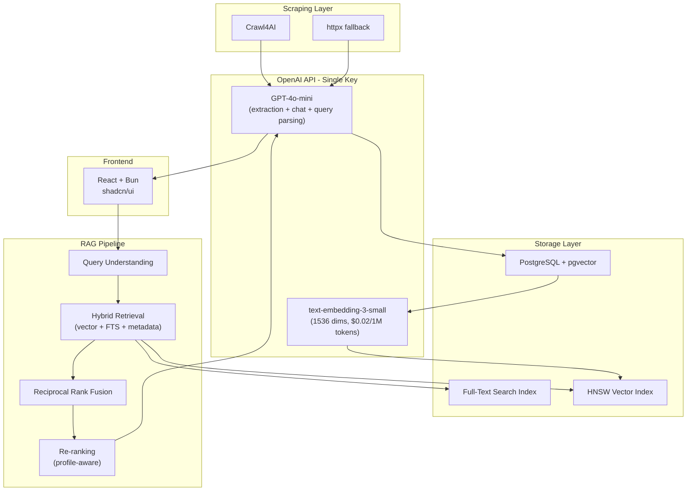
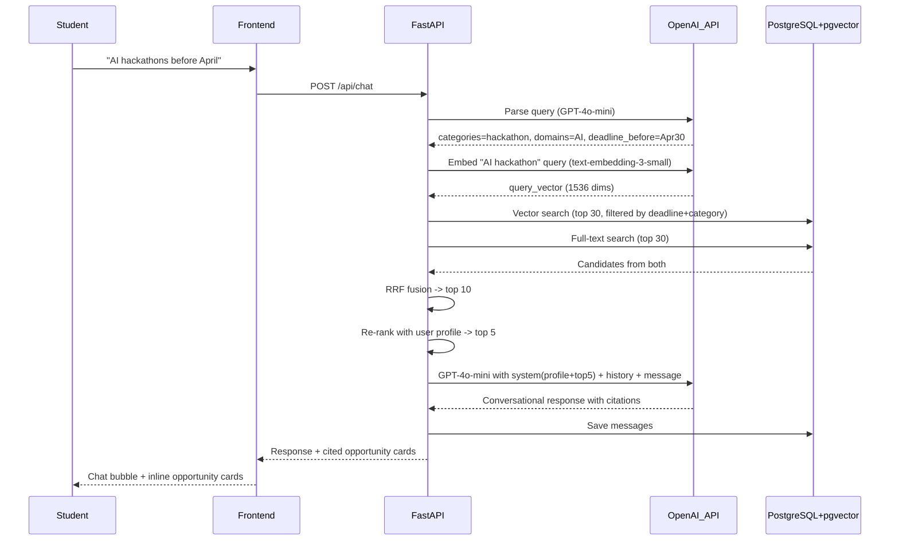

# SOIP: RAG-First Architecture Plan

## Architecture Overview




---

## Tech Stack (with rationale)

### Scraping: Crawl4AI (primary) + httpx (lightweight fallback)

- **Why Crawl4AI:** Free, open-source, outputs clean Markdown (not raw HTML), built-in Playwright for JS rendering, async, LangChain/LlamaIndex integrations. Purpose-built for LLM/RAG pipelines.
- **Why not ScrapingBee:** $49-599/month. Crawl4AI does the same thing for free.
- **httpx fallback:** For the 6 static HTML sources (gov.in sites), httpx is faster and lighter than spinning up a browser.

### All AI: OpenAI (single API key)

One `OPENAI_API_KEY` powers extraction, embeddings, query understanding, and chat responses.

**Extraction + Chat + Query Understanding: GPT-4o-mini**

- **Why:** Extremely cost-effective ($0.15/1M input, $0.60/1M output), strong at structured JSON extraction and conversational responses, 128K context window.
- **Extraction cost:** 15 sources x ~20K tokens = 300K tokens/cycle = **$0.075 per scrape cycle**.
- **Chat cost:** ~2K input + ~500 output per turn = **$0.0006 per chat turn** — 1,600 chats per dollar.
- **Upgrade path:** Swap to GPT-4o ($2.50/1M input) for chat responses if higher quality is needed — just change the model string.

**Embeddings: text-embedding-3-small**

- **Why:** $0.02/1M tokens, 1536 dimensions, solid retrieval quality (nDCG@10: 0.762), supports `dimensions` parameter to reduce to 512 if needed for faster search.
- **Cost:** ~500 opportunities x 300 tokens = 150K tokens = **$0.003 per full re-embed** — essentially free.

### Vector Store: pgvector (PostgreSQL extension)

- **Why:** No extra infrastructure — add `CREATE EXTENSION vector;` to existing PostgreSQL. Supports HNSW indexes (3ms query time), metadata filtering in the same SQL query. For 500-1000 vectors, performance is instant.
- **Why not Pinecone/Qdrant:** Extra service to manage, costs money, unnecessary at this scale.

### Backend: FastAPI + SQLAlchemy + Alembic

- Same rationale as before — async, type-safe, auto-docs, ideal for AI-heavy APIs.

### Frontend: React 19 + Bun + TailwindCSS 4 + shadcn/ui

- Modern, polished demo UI with minimal effort. Bun for fast dev server.

### Scheduling: APScheduler

- Lightweight, runs inside the FastAPI process, no extra infra.

---

## Cost Analysis


| Component                           | Per Scrape Cycle (15 sources) | Per Chat Turn | Monthly (daily scrape + 100 chats/day) |
| ----------------------------------- | ----------------------------- | ------------- | -------------------------------------- |
| Scraping (Crawl4AI)                 | $0.00                         | -             | $0.00                                  |
| Extraction (GPT-4o-mini)            | $0.075                        | -             | $2.25                                  |
| Embeddings (text-embedding-3-small) | $0.003                        | -             | $0.09                                  |
| Query understanding (GPT-4o-mini)   | -                             | $0.0001       | $0.30                                  |
| Chat response (GPT-4o-mini)         | -                             | $0.0006       | $1.80                                  |
| Vector DB (pgvector)                | $0.00                         | $0.00         | $0.00                                  |
| **Total**                           | **$0.078**                    | **$0.0007**   | **~$4.50/month**                       |


**Single OpenAI API key. ~$4.50/month total.** Compare to the reference codebase approach (ScrapingBee + Claude Haiku): ~$80-120/month. That is a **95% cost reduction**.

---

## Project Structure

```
soip-v2/
├── docker-compose.yml
├── init.sql
├── .env.example               # Template for required env vars
├── .gitignore
├── README.md                  # Setup instructions, architecture overview
├── Makefile                   # Convenience commands (make up, make down, make migrate, etc.)
├── backend/
│   ├── Dockerfile
│   ├── pyproject.toml
│   ├── requirements.txt          # Pinned deps for pip install
│   ├── alembic.ini
│   ├── alembic/
│   │   ├── env.py
│   │   └── versions/
│   ├── app/
│   │   ├── main.py
│   │   ├── config.py
│   │   ├── database.py
│   │   ├── models/
│   │   │   ├── base.py
│   │   │   ├── university.py
│   │   │   ├── user.py
│   │   │   ├── source.py
│   │   │   ├── opportunity.py       # includes embedding column
│   │   │   ├── chat.py
│   │   │   └── alert.py
│   │   ├── schemas/
│   │   │   ├── auth.py
│   │   │   ├── user.py
│   │   │   ├── opportunity.py
│   │   │   └── chat.py
│   │   ├── routers/
│   │   │   ├── auth.py
│   │   │   ├── opportunities.py
│   │   │   ├── chat.py
│   │   │   └── users.py
│   │   ├── services/
│   │   │   ├── auth.py
│   │   │   ├── embedder.py          # OpenAI text-embedding-3-small
│   │   │   ├── retriever.py         # Hybrid search + RRF
│   │   │   ├── chat.py              # RAG orchestration
│   │   │   ├── relevance.py         # Profile-aware re-ranking
│   │   │   └── scraper/
│   │   │       ├── client.py        # Crawl4AI + httpx
│   │   │       ├── extractor.py     # GPT-4o-mini extraction
│   │   │       ├── pipeline.py
│   │   │       ├── scheduler.py
│   │   │       └── seed.py
│   │   └── utils/
│   │       └── dependencies.py
│   └── tests/
├── frontend/
│   ├── Dockerfile
│   ├── package.json
│   ├── src/
│   │   ├── index.ts
│   │   ├── index.html
│   │   ├── frontend.tsx
│   │   ├── lib/
│   │   │   ├── api.ts
│   │   │   └── auth.ts
│   │   ├── pages/
│   │   │   ├── LoginPage.tsx
│   │   │   ├── OnboardingPage.tsx
│   │   │   ├── DashboardPage.tsx
│   │   │   ├── BrowsePage.tsx
│   │   │   ├── OpportunityPage.tsx
│   │   │   └── ChatPage.tsx
│   │   └── components/
│   │       ├── ui/
│   │       ├── Layout.tsx
│   │       ├── OpportunityCard.tsx
│   │       ├── ChatBubble.tsx
│   │       └── FilterSidebar.tsx
│   └── styles/
└── scripts/
    └── seed_curated.py
```

---

## Phase 1: Infrastructure and Data Layer

### Database Schema

**Opportunity model** (the core RAG document):

```python
class Opportunity(Base):
    __tablename__ = "opportunities"

    id            = Column(UUID, primary_key=True)
    title         = Column(String, nullable=False)
    description   = Column(Text, nullable=False)
    category      = Column(SQLEnum(OpportunityCategory), nullable=False)
    domain_tags   = Column(JSON, nullable=False)        # ["AI", "climate"]
    eligibility   = Column(Text, nullable=True)          # PRD 8.3
    benefits      = Column(Text, nullable=True)          # PRD 8.3
    deadline      = Column(Date, nullable=True)
    url           = Column(String, unique=True, nullable=False)
    source_id     = Column(UUID, ForeignKey("sources.id"))
    source_url    = Column(String, nullable=False)
    confidence    = Column(Float, nullable=True)         # extraction confidence
    is_active     = Column(Boolean, default=True)
    scraped_at    = Column(DateTime)
    created_at    = Column(DateTime)
    updated_at    = Column(DateTime)

    # Vector embedding (OpenAI text-embedding-3-small, 1536 dims)
    embedding     = Column(Vector(1536), nullable=True)

    # Full-text search generated column
    search_vector = Column(TSVECTOR)  # generated from title + description
```

Key indexes:

- `HNSW` on `embedding` using cosine distance
- `GIN` on `search_vector` for full-text search
- `B-tree` on `deadline`, `category`, `is_active` for metadata filtering

**User model** (for personalization):

```python
class User(Base):
    __tablename__ = "users"

    id             = Column(UUID, primary_key=True)
    email          = Column(String, unique=True)
    password_hash  = Column(String)
    university_id  = Column(UUID, ForeignKey("universities.id"))
    first_name     = Column(String)
    degree_type    = Column(String)          # "B.Tech", "M.Sc", etc.
    skills         = Column(JSON)            # ["Python", "ML", "React"]
    interests      = Column(JSON)            # ["AI", "climate", "fintech"]
    aspirations    = Column(JSON)            # ["hackathons", "internships"]
    is_onboarded   = Column(Boolean, default=False)
    created_at     = Column(DateTime)
```

**ChatSession / ChatMessage** (for conversation persistence):

```python
class ChatSession(Base):
    id         = Column(UUID, primary_key=True)
    user_id    = Column(UUID, ForeignKey("users.id"))
    title      = Column(String)
    created_at = Column(DateTime)

class ChatMessage(Base):
    id                    = Column(UUID, primary_key=True)
    session_id            = Column(UUID, ForeignKey("chat_sessions.id"))
    role                  = Column(String)  # "user" | "assistant"
    content               = Column(Text)
    cited_opportunity_ids = Column(JSON)    # UUIDs of referenced opportunities
    created_at            = Column(DateTime)
```

### Docker Compose

3 services: postgres (with pgvector extension), backend, frontend. Same pattern as reference but with `pgvector/pgvector:pg17` image.

---

## Phase 2: Scraping and Extraction Pipeline

### Scraping Client (`services/scraper/client.py`)

```python
async def scrape_source(source: Source) -> str:
    """Returns clean markdown content from a source URL."""
    cfg = source.config
    if cfg.get("scraper_type") == "html":
        # Lightweight: httpx + BeautifulSoup -> markdown
        return await _fetch_static(cfg["listing_url"])
    else:
        # JS-heavy: Crawl4AI with Playwright
        return await _fetch_with_crawl4ai(
            url=cfg["listing_url"],
            render_js=True
        )
```

Crawl4AI returns clean markdown by default — no raw HTML soup. This reduces token usage by ~60% compared to sending raw HTML to the LLM.

### Extraction (`services/scraper/extractor.py`)

Uses **GPT-4o-mini** with structured JSON output:

```python
async def extract_opportunities(markdown: str, source_url: str) -> list[ExtractedOpportunity]:
    """Use GPT-4o-mini to extract structured opportunities from markdown."""
    response = await openai_client.chat.completions.create(
        model="gpt-4o-mini",
        response_format={"type": "json_object"},
        messages=[
            {"role": "system", "content": SYSTEM_PROMPT},
            {"role": "user", "content": f"Extract from: {source_url}\n\n{markdown}"}
        ],
        temperature=0.1
    )
    return parse_opportunities(response.choices[0].message.content)
```

Enriched extraction schema (PRD section 8.3 canonical definition):

```python
@dataclass
class ExtractedOpportunity:
    title: str
    description: str
    category: str           # hackathon|grant|fellowship|internship|...
    domain_tags: list[str]
    eligibility: str | None # NEW: who can apply
    benefits: str | None    # NEW: what you get
    deadline: date | None
    url: str | None
    confidence: float       # NEW: 0.0-1.0 extraction confidence
```

### Embedding Generation (`services/embedder.py`)

After extraction and insertion, generate embeddings for new/updated opportunities:

```python
def prepare_embedding_text(opp: Opportunity) -> str:
    """Create a structured text optimized for embedding."""
    parts = [
        f"Title: {opp.title}",
        f"Category: {opp.category.value}",
        f"Domains: {', '.join(opp.domain_tags)}",
        f"Description: {opp.description}",
    ]
    if opp.eligibility:
        parts.append(f"Eligibility: {opp.eligibility}")
    if opp.benefits:
        parts.append(f"Benefits: {opp.benefits}")
    if opp.deadline:
        parts.append(f"Deadline: {opp.deadline.isoformat()}")
    return "\n".join(parts)

async def embed_opportunities(opportunities: list[Opportunity]):
    """Batch embed via OpenAI text-embedding-3-small and store in pgvector."""
    texts = [prepare_embedding_text(o) for o in opportunities]
    response = await openai_client.embeddings.create(
        model="text-embedding-3-small",
        input=texts
    )
    for opp, data in zip(opportunities, response.data):
        opp.embedding = data.embedding
```

### Pipeline Orchestration (`services/scraper/pipeline.py`)

```
For each enabled source:
  1. Scrape (Crawl4AI/httpx) → markdown
  2. Extract (Gemini Flash) → structured opportunities
  3. Deduplicate by URL
  4. Insert new / update changed (detect deadline/description changes)
  5. Generate embeddings for new/updated (text-embedding-3-small)
  6. Mark past-deadline opportunities as is_active=False
  7. Update source.last_scraped_at
```

### Change Detection

On re-scrape, if a URL already exists in DB:

- Compare `deadline` and `description`
- If changed: update fields, set `updated_at = now()`, re-embed, create alerts for relevant users
- This satisfies PRD section 8.2 (change detection)

### Auto-Expiry

A scheduled job (APScheduler, runs hourly):

```sql
UPDATE opportunities SET is_active = false
WHERE deadline < CURRENT_DATE AND is_active = true;
```

---

## Phase 3: RAG Pipeline (the core)

This is the heart of the system. The RAG pipeline handles every user query — whether from the chat interface or the search bar.

### Step 1: Query Understanding

```python
async def understand_query(message: str, user: User) -> ParsedQuery:
    """Use GPT-4o-mini to parse the user's intent."""
    # Cheap call (~500 tokens input, ~100 tokens output = $0.0001)
    prompt = f"""Parse this student opportunity query. Return JSON:
    {{
      "intent": "search|ask|explore",
      "search_text": "semantic search query",
      "categories": ["hackathon", ...] or null,
      "domains": ["AI", ...] or null,
      "deadline_before": "YYYY-MM-DD" or null,
      "deadline_after": "YYYY-MM-DD" or null
    }}
    Today is {date.today()}. Query: "{message}"
    """
    # Returns ParsedQuery dataclass
```

This step converts "What AI hackathons can I join before April?" into structured filters + a semantic search query.

### Step 2: Hybrid Retrieval (`services/retriever.py`)

Three retrieval signals, fused with Reciprocal Rank Fusion (RRF):

```python
async def hybrid_retrieve(
    query: ParsedQuery, query_embedding: list[float], limit: int = 10
) -> list[ScoredOpportunity]:

    # 1. VECTOR SEARCH — semantic similarity via pgvector
    vector_results = db.execute(text("""
        SELECT id, title, embedding <=> :qe AS distance
        FROM opportunities
        WHERE is_active = true
          AND (deadline IS NULL OR deadline >= CURRENT_DATE)
          AND (:cat IS NULL OR category = :cat)
        ORDER BY embedding <=> :qe
        LIMIT 30
    """), {"qe": query_embedding, "cat": query.categories})

    # 2. FULL-TEXT SEARCH — keyword matching via tsvector
    fts_results = db.execute(text("""
        SELECT id, title,
               ts_rank(search_vector, plainto_tsquery(:q)) AS rank
        FROM opportunities
        WHERE is_active = true
          AND search_vector @@ plainto_tsquery(:q)
          AND (deadline IS NULL OR deadline >= CURRENT_DATE)
        ORDER BY rank DESC
        LIMIT 30
    """), {"q": query.search_text})

    # 3. METADATA BOOST — deadline proximity + recency
    # Opportunities with deadlines in the next 14 days get boosted

    # 4. RRF FUSION — combine rankings
    # score = 1/(k + vector_rank) + 1/(k + fts_rank) + freshness_boost
    # k = 60 (standard RRF constant)
    return top_k(fused_results, limit)
```

**Why hybrid?** Pure vector search cannot handle "before April" or "this week" — it needs metadata filtering. Pure keyword search misses "startup programs" when the user asks about "entrepreneurship opportunities". Hybrid with RRF gives you both.

**Why metadata filtering matters for time accuracy:**

- `WHERE deadline >= CURRENT_DATE` — never surface expired opportunities
- `WHERE deadline <= :deadline_before` — respect temporal constraints
- Deadline proximity boost — upcoming deadlines rank higher

### Step 3: Profile-Aware Re-ranking (`services/relevance.py`)

```python
def rerank_for_user(
    user: User, candidates: list[ScoredOpportunity]
) -> list[ScoredOpportunity]:
    """Boost candidates that match the user's profile."""
    for opp in candidates:
        tag_overlap = len(
            set(opp.domain_tags) & set(user.interests + user.skills)
        )
        category_match = opp.category in (user.aspirations or [])
        deadline_urgency = max(0, 14 - (opp.deadline - date.today()).days) / 14
            if opp.deadline else 0

        opp.relevance_score = (
            0.4 * opp.hybrid_score    # base retrieval score
          + 0.3 * (tag_overlap / max(len(opp.domain_tags), 1))
          + 0.2 * (1.0 if category_match else 0.0)
          + 0.1 * deadline_urgency
        )
    return sorted(candidates, key=lambda o: o.relevance_score, reverse=True)
```

Lightweight, deterministic, zero LLM cost. Works instantly.

### Step 4: Response Generation (`services/chat.py`)

```python
async def generate_response(
    user: User, message: str, retrieved: list[ScoredOpportunity],
    history: list[ChatMessage]
) -> ChatResponse:
    """Generate conversational response with GPT-4o-mini."""

    system_prompt = f"""You are SOIP, an AI assistant that helps students discover opportunities.

Student profile:
- Name: {user.first_name}
- Degree: {user.degree_type}
- Skills: {', '.join(user.skills or [])}
- Interests: {', '.join(user.interests or [])}
- Looking for: {', '.join(user.aspirations or [])}

Retrieved opportunities (ranked by relevance):
{format_opportunities(retrieved[:5])}

Rules:
- Cite opportunities by [title](url) format
- Explain WHY each is relevant to this student
- Mention deadlines prominently
- If no good matches, suggest broadening criteria
- Be concise and actionable"""

    messages = [{"role": "system", "content": system_prompt}]
    messages += format_chat_history(history[-10:])
    messages += [{"role": "user", "content": message}]

    response = await openai_client.chat.completions.create(
        model="gpt-4o-mini",
        messages=messages,
        max_tokens=1024,
        temperature=0.7
    )
    return ChatResponse(
        content=response.choices[0].message.content,
        cited_opportunities=[o.id for o in retrieved[:5]],
        session_id=session_id
    )
```

### Full RAG Query Flow




---

## Phase 4: API Endpoints

### Auth

- `POST /api/auth/register` — email, password, university_id
- `POST /api/auth/login` — returns JWT
- `GET /api/auth/me` — current user

### Profile

- `PUT /api/users/profile` — update 5 onboarding fields
- `GET /api/users/profile` — get profile

### Opportunities

- `GET /api/opportunities` — browse with filters (category, tags, deadline range, search, pagination)
- `GET /api/opportunities/{id}` — detail view
- `GET /api/opportunities/recommended` — personalized top 10 (uses relevance scoring)

### Chat

- `POST /api/chat` — send message, get RAG-powered response
- `GET /api/chat/sessions` — list sessions
- `GET /api/chat/sessions/{id}` — message history

### Alerts

- `GET /api/alerts` — user's unread alerts
- `PUT /api/alerts/{id}/read` — mark read

---

## Phase 5: Frontend

### Page Structure

**ChatPage (primary experience):**

- Full-height chat interface
- Message bubbles with markdown rendering
- Inline opportunity cards when assistant cites them (clickable -> detail)
- Session sidebar (collapsible)
- Suggested prompts for first-time users: "What hackathons are coming up?", "Show me AI internships", "What should I explore based on my skills?"

**BrowsePage (secondary experience):**

- Card grid layout with opportunity cards
- Left sidebar: category checkboxes, deadline range picker, domain tag pills, search input
- Sort by: relevance, deadline (soonest), newest
- Deadline countdown badges on cards (e.g., "3 days left", "2 weeks left")

**DashboardPage:**

- "Recommended for you" — top 6 from /recommended endpoint
- "New this week" — recently added
- "Expiring soon" — deadline within 7 days
- Alert feed

**OnboardingPage:**

- Single form: degree_type (dropdown), skills (tag input), interests (tag input), aspirations (checkbox group), first_name
- Completed in under 60 seconds

### Key Components

- `OpportunityCard` — title, category badge (color-coded), deadline countdown, domain tag pills, 2-line description, relevance score bar
- `ChatBubble` — supports markdown, inline opportunity cards, typing indicator
- `FilterSidebar` — collapsible filters with instant apply
- `Layout` — top nav + side nav (Dashboard, Browse, Chat, Alerts)

---

## Phase 6: Scheduling and Alerts

- **APScheduler** runs inside FastAPI lifespan:
  - Every 6 hours: full scraping pipeline
  - Every hour: auto-expire past-deadline opportunities
  - After each scrape: generate alerts for users with relevance score > 0.7 on new opportunities
- Alert model stores `user_id`, `opportunity_id`, `reason` (e.g., "New AI hackathon matching your interests")
- Frontend bell icon with unread count

---

## Implementation Order


| Phase | What                                                                    | Depends On  | Estimated Effort |
| ----- | ----------------------------------------------------------------------- | ----------- | ---------------- |
| 1     | Docker + DB schema + models + Alembic migration + pgvector setup        | Nothing     | 1 day            |
| 2     | Scraping pipeline (Crawl4AI + GPT-4o-mini extraction + seed 15 sources) | Phase 1     | 2 days           |
| 3a    | Embedding service (text-embedding-3-small) + vector indexing            | Phase 1     | 0.5 days         |
| 3b    | Auth (JWT register/login/me)                                            | Phase 1     | 1 day            |
| 4     | RAG pipeline (query understanding + hybrid search + RRF + re-ranking)   | Phase 2, 3a | 2 days           |
| 5     | Chat service (GPT-4o-mini + history) + opportunity API                  | Phase 3b, 4 | 1.5 days         |
| 6     | Frontend (all pages)                                                    | Phase 3b, 5 | 3 days           |
| 7     | Alerts + scheduling                                                     | Phase 4, 6  | 1 day            |
|       | **Total**                                                               |             | **~12 days**     |


Phases 2, 3a, and 3b can run in parallel after Phase 1.